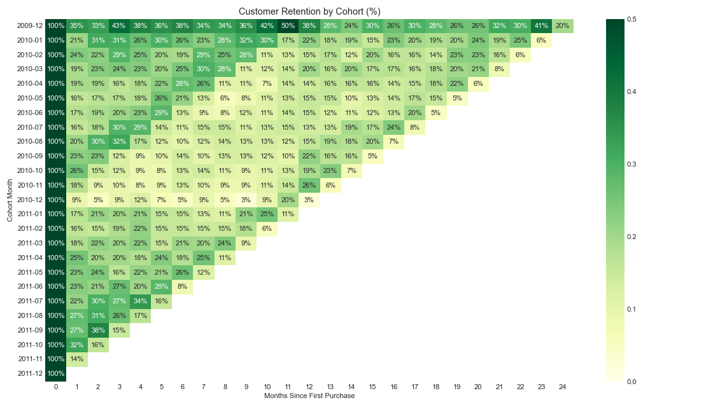
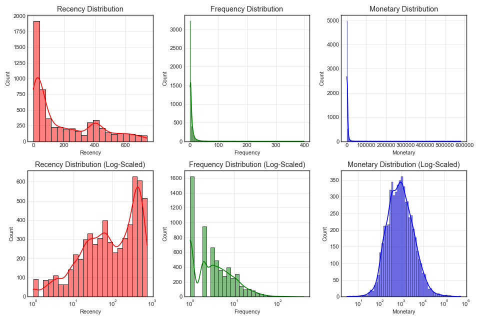
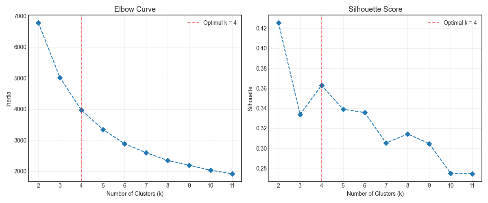
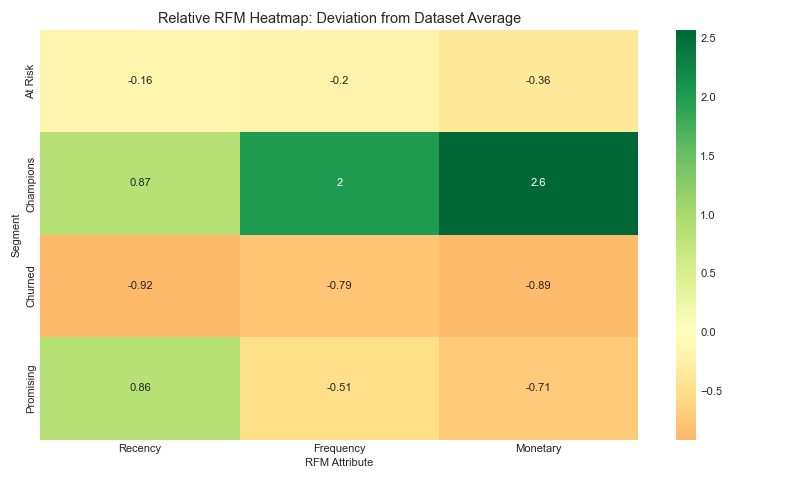
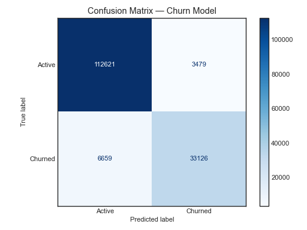
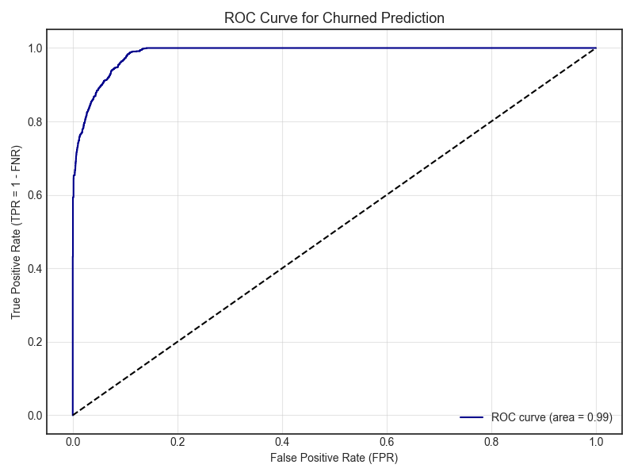

# 📊 Customer Segmentation & Churn Prediction with RFM + K-Means

> An end-to-end machine learning project for e-commerce customer segmentation, cohort retention analysis, and churn prediction using RFM analysis and K-Means clustering.

---

## Introduction & Data Dictionary

The dataset captures 1,067,371 e-commerce transactions over two years (Dec 2009 - Dec 2011) for a UK-based online retailer.

| Feature | Type | Description |
| :--- | :--- | :--- |
| `Invoice` | Nominal | 6-digit transaction ID. 'C' prefix = cancellation |
| `StockCode` | Nominal | 5-digit product ID |
| `Description` | Nominal | Product name |
| `Quantity` | Numeric | Units purchased per transaction |
| `InvoiceDate` | DateTime | Transaction timestamp |
| `Price` | Numeric | Price per unit (£) |
| `Customer ID` | Nominal | 5-digit customer ID |
| `Country` | Nominal | Customer country |

---

## 🎯 Objectives

This project uses RFM analysis, K-Means clustering, and Cohort Analysis to segment customers and track retention dynamics on the Online Retail II dataset.

| # | Objective | Method |
|:--:|:---|:---|
| 1 | Track retention dynamics | Cohort analysis & heatmaps |
| 2 | Engineer RFM profiles | Recency, Frequency, Monetary calculation |
| 3 | Segment customers | K-Means clustering (k=4) |
| 4 | Profile clusters | Relative importance heatmaps |
| 5 | Predict churn | Logistic Regression |

---

## 🏗️ Data Processing & Wrangling

| Step | Action |
|:---|:---|
| Hygiene | Cleaned column names |
| Missing | Dropped null Customer IDs; filled descriptions with 'unknown' |
| Duplicates | Removed duplicate rows |
| Anomalies | Removed cancelled orders (prefix 'C'), negative qty/price |
| Features | Created `TotalPrice = Quantity × Price`, `is_UK` flag (1 = United Kingdom, 0 = other countries) |

---

## 📊 Visualizations

### Cohort Analysis

| Finding | Action |
|:---|:---|
| **78.83% Month 1 Churn** | Low-cost re-engagement |
| **Dec 2009 strongest** | Exclusive rewards |
| **19.69% survive 24 months** | Loyalty programs |
| **Dec 2010 weakest** | Post-Christmas win-back |



### RFM Distributions



*Log transformed + Standardized (mean=0, std=1)*

### KMeans Clustering

**Optimal Clusters:** Elbow method + Silhouette score for k=2 to 12. Optimal k where inertia slows and silhouette peaks.



**Result:** Optimal clusters = 4

### RFM Segments

**Legend:** Recency (days since purchase), Frequency (purchase count), Monetary (total spend in £). K-Means on standardized scores.

| Segment | Recency | Frequency | Monetary | Strategy |
|:---:|:---:|:---:|:---:|:---|
| **Champions** | 27 days | 18.9 | £10,565 | Exclusive rewards |
| **Promising** | 28 days | 3.1 | £844 | Marketing campaigns |
| **At Risk** | 234 days | 5.1 | £1,897 | Win-back discounts |
| **Churned** | 386 days | 1.3 | £317 | Low-cost re-engagement |



## 🤖 Churn Prediction Model

> ⚠️ **Methodology Note:** The dataset does not contain churn labels. Churn labels were created using KMeans clustering. As the Logistic Regression model is trained on the same RFM features used to generate the labels, data leakage exists — resulting in higher accuracy. Retained only to demonstrate an end-to-end ML pipeline.

**Model:** Logistic Regression with StandardScaler pipeline

**Features:** `Recency`, `Frequency`, `Monetary`, `is_UK`

**Results:**

| Metric | Value | Interpretation |
|:---|:---:|:---|
| False Positive Rate (FPR) | 3% | 3% of 116,100 active customers wrongly labeled as churned |
| False Negative Rate (FNR) | 17% | 17% of 39,785 churned customers wrongly labeled as non-churned |
| True Positive Rate (TPR) | 83% | 83% of all churned customers identified by the model |
| Accuracy | 93.5% | 93.5% of 155,885 customers correctly classified (inflated due to data leakage) |



*Note: AUC inflated due to data leakage from RFM-based labels*

---

## 📥 Installation

**Prerequisites:** Python 3.8+
```bash
# Clone repository
git clone https://github.com/aguchhait-stack/Online_Retail_II.git
cd Online_Retail_II

# Install dependencies
pip install -r requirements.txt

# # Run full pipeline (python3 for macOS/Linux, python for Windows)
python3 main.py

# Explore notebook
jupyter notebook notebook.ipynb
```
---

## 📁 Project Structure

```
Online_Retail_II/
├── README.md
├── requirements.txt
├── main.py
├── notebook.ipynb
├── data/
│   └── online+retail+ii.zip
├── src/
│   ├── load_data.py
│   ├── preprocess.py
│   ├── rfm.py
│   ├── segment.py
│   ├── cohort.py
│   ├── model.py
│   └── visualise.py
└── outputs/
    ├── cohort_heatmap.png
    ├── confusion_matrix.png
    ├── elbow_silhouette_validation.png
    ├── rfm_distributions.png
    ├── rfm_segment_heatmap.png
    └── roc_curve.png
```
---

## 🙏  Acknowledgments

- UCI Machine Learning Repository for dataset access
- Open-source Python community for libraries
- Claude (Anthropic) and DeepSeek for modular coding and debugging

---

## 📄 License & Citation

**Dataset Citation:**  
Chen, D. (2012). *Online Retail II* [Dataset]. UCI Machine Learning Repository. https://doi.org/10.24432/C5CG6D

**Dataset License:** Creative Commons Attribution 4.0 International (CC BY 4.0)

---

## 👨‍💻 Author

**Arijit Guchhait**  
[](https://github.com/aguchhait-stack)

